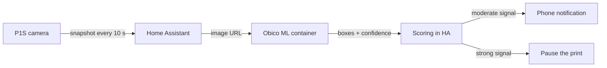

# P1S AI Print Monitor for Home Assistant

Camera-based print failure ("spaghetti") detection for the Bambu Lab P1S in Home Assistant, using a self-hosted [Obico](https://github.com/TheSpaghettiDetective/obico-server) ML backend and Obico's own scoring logic to keep false alarms down.

> **Status: experimental.** Tested on one P1S with Home Assistant OS and an x86-64 Docker host. Run it in Notify Only mode first and do not treat it as a safety device.

## Why

The Obico ML API returns every box it finds with a confidence of 0.08 or higher. Treating "any box" as a failure produces a steady stream of false alarms. Obico's server never does that: it scores each frame, smooths the score and compares it with a long-term baseline for that printer. This package ports that scoring to Home Assistant, so you get the same behaviour with a plain HA setup and no Obico account.

## Features

- **Obico-style scoring**: per-frame score, fast moving average, per-print mean and a long-term printer baseline that absorbs constant background noise from your camera view.
- **Two alert levels**: a warning first, a pause only when the signal is 1.75× stronger.
- **Stage-aware**: frames are analysed only in the `printing` stage, so heating, levelling and nozzle wiping are ignored.
- **Chamber light management**: the light stays on while the AI watches; a dark-print mode is kept for when the AI is off.
- **Review flow**: dashboard buttons to resume, stop or mark a false alarm, with a cooldown afterwards.
- **Tuning data**: suspicious frames are archived for 14 days and their boxes are written to the Logbook; ignore zones and a sensitivity slider act on that data.
- **Plain YAML**: one Home Assistant package, one dashboard view, built-in cards only.

## How it works



See [docs/how-it-works.md](docs/how-it-works.md) for the scoring details.

## Requirements

| Item | Requirement |
| --- | --- |
| Home Assistant | 2024.10 or newer, with YAML packages enabled |
| Printer integration | [ha-bambulab](https://github.com/greghesp/ha-bambulab) with P1S entities, including a working camera entity |
| ML host | An x86-64 (amd64) Docker host on the LAN, no GPU needed. HA Green, HA Yellow and Raspberry Pi cannot run it |
| Network | The ML host can reach `http://<HA IP>:8123` |
| Notifications | Home Assistant Companion app |

## Quick start

1. Deploy the ML backend from [`ml-backend/`](ml-backend/).
2. Copy [`homeassistant/packages/p1s_ai.yaml`](homeassistant/packages/p1s_ai.yaml) into your HA `packages` folder and replace the four placeholders.
3. Add a secret `p1s_ml_auth_header: "Bearer <token>"` and restart Home Assistant.
4. Add the dashboard view from [`homeassistant/dashboard/p1s_ai_view.yaml`](homeassistant/dashboard/p1s_ai_view.yaml).
5. Run the first prints in Notify Only mode, then enable Auto Pause.

The full step-by-step guide, including verification, tuning and troubleshooting, is in [docs/installation.md](docs/installation.md).

## Repository layout

```
homeassistant/packages/p1s_ai.yaml       Home Assistant package (helpers, automations, scripts)
homeassistant/dashboard/p1s_ai_view.yaml Dashboard view, built-in cards only
ml-backend/compose.yaml                  Obico ML + Redis stack
ml-backend/.env.example                  Token template
docs/                                    Installation guide and design notes
```

## Limitations

- One P1S per package. Other Bambu models with a camera may work after renaming entities, but this is untested.
- Entity IDs assume an English Home Assistant setup; translated entity IDs must be replaced by hand.
- The Obico ML backend runs on x86-64 only. ARM machines such as HA Green, HA Yellow and Raspberry Pi cannot run it, not even as a Home Assistant add-on, so you need a separate x86-64 machine.
- The ML container downloads snapshots from HA over plain HTTP on the LAN.
- Snapshots in `/config/www/obico` are served at `/local/` without authentication. Block that path if HA is exposed to the internet.
- The `time-sensitive` notification level is an iOS feature; Android ignores it.

## Related projects

- [nberktumer/ha-bambu-lab-p1-spaghetti-detection](https://github.com/nberktumer/ha-bambu-lab-p1-spaghetti-detection): a custom integration and blueprint around the same Obico ML backend.
- [Obico](https://www.obico.io/): the original AI failure detection service for 3D printers.

## Credits

- The ML model and the scoring algorithm come from [Obico](https://github.com/TheSpaghettiDetective/obico-server) (AGPL-3.0). The scoring in this package is a port of `backend/lib/prediction.py` with its default parameters.
- Printer entities are provided by [ha-bambulab](https://github.com/greghesp/ha-bambulab).

## License

[AGPL-3.0](LICENSE). This project is not affiliated with Bambu Lab or Obico.
